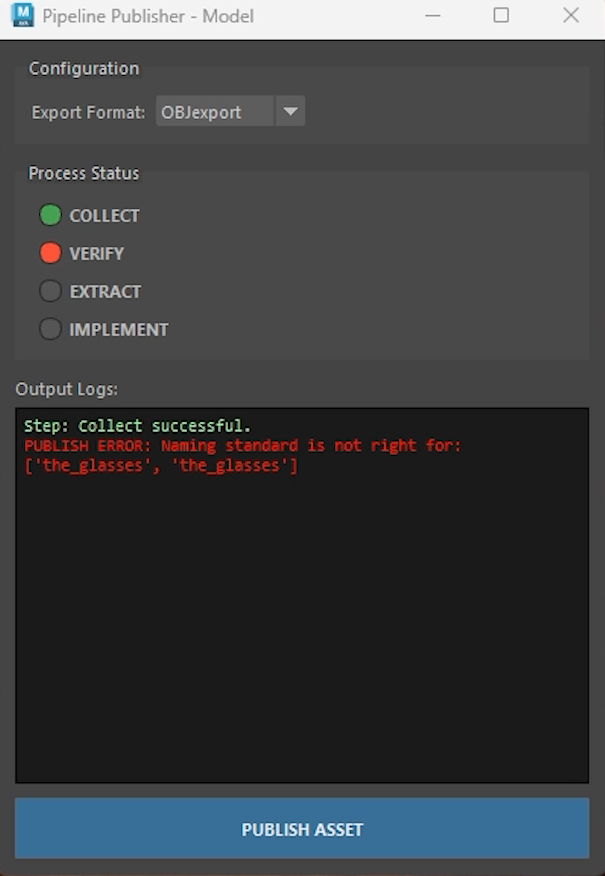

# Modeling_Publisher_maya
### Modeling publisher that uses the principles of CVEI with discord push notifications for enforcing publishing standards in production.
A publisher tool to verify the model's integrity, file naming conventions, and model qualities (e.g., ngons or lamina-faced elements) before exporting to look development.

# Demo Videos:
Click to see the Demo:

# The Problem
I am not a good modeler and often make mistakes in my models that eventually come back to haunt me during my texturing or rigging phase. 
Using my Python skills, I attempted to build a production-level publishing tool that ensures our models are optimized for the next stages of our 3D development.  

# The Solution
The first stage was to build the class system with the different steps and the basic functions, in case I want to further develop this tool into multiple departments, such as lighting or rigging. 
 
For the modeling tool, I used class inheritance to build the specific functions I needed for my object to verify the specific problems a 3d model might have in production. I built a UV checker, an ngon checker, lamina faces, and of course, checked the naming convention. 

In the extraction face, it exports the model as either an OBJ or FBX to the assets folder in the standard Maya project folder  structure. I stored the published information in a CSV to later transfer into an Excel, Google Sheet, or production tracking software like ShotGrid. 

My most exciting integration was the use of enviroment variables to store and access my production Discord bot link to send a notification when I publish a model into my respective Discord channel.

# For the future
I would like to enhance this tool with the use of USD to export full scenes into different DCCs.

